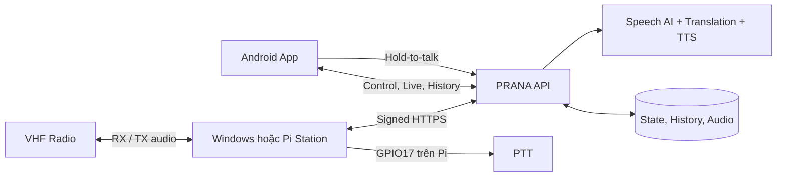

<p align="center">
  
</p>

<h1 align="center">PRANA ELEX</h1>

<p align="center">
  Nền tảng nhận dạng, dịch và truyền thông tin thoại VHF gần thời gian thực.<br>
  Kết nối Android, Station tại hiện trường và Cloud AI trong một luồng RX/TX thống nhất.
</p>

<p align="center">
  <a href="https://github.com/VQ-Vinh/VHF/actions/workflows/ci.yml"></a>
  <a href="https://github.com/VQ-Vinh/VHF/releases/latest"></a>
  
  
  
  
</p>

<p align="center">
  <a href="#tổng-quan">Tổng quan</a> •
  <a href="#tính-năng">Tính năng</a> •
  <a href="#luồng-hoạt-động">Luồng hoạt động</a> •
  <a href="#quick-start">Quick Start</a> •
  <a href="#kiến-trúc">Kiến trúc</a> •
  <a href="#cấu-trúc-dự-án">Cấu trúc dự án</a> •
  <a href="#phát-triển">Phát triển</a> •
  <a href="#tài-liệu">Tài liệu</a> •
  <a href="#đóng-góp">Đóng góp</a>
</p>

---

## Tổng quan

PRANA ELEX biến audio thoại VHF thành nội dung có thể theo dõi và sử dụng trên
Android: Station thu tín hiệu, Cloud xử lý nhận dạng/dịch, còn App hiển thị kết
quả trực tiếp và điều khiển RX/TX từ xa.

Hệ thống dành cho đội vận hành VHF, kỹ sư triển khai Station và developer phát
triển pipeline đa nền tảng. Android và Station chỉ cần Internet, không cần cùng
mạng LAN hoặc mở inbound port.

Điểm khác biệt chính:

- một Station Runtime dùng chung cho Laptop Windows và Raspberry Pi;
- pipeline RX dùng VAD, segmentation và lưu trữ có cấu trúc;
- TX hold-to-talk có bước review trước khi phát và interlock half-duplex;
- credential Cloud, AI prompt và quyền dữ liệu chỉ tồn tại ở backend.

## Tính năng

| Khả năng | Mô tả |
| --- | --- |
| **RX gần thời gian thực** | Thu audio VHF, chia segment, nhận dạng và dịch sang ngôn ngữ đích. |
| **TX hold-to-talk** | Thu âm trên Android, cho phép review/chỉnh nội dung rồi mới tổng hợp và phát. |
| **Half-duplex an toàn** | Station dừng RX, điều khiển PTT, phát TX và chỉ resume khi trạng thái vẫn hợp lệ. |
| **Station đa nền tảng** | Windows dùng WASAPI; Raspberry Pi dùng ALSA/`arecord` và hỗ trợ GPIO17 PTT. |
| **Cloud-first** | Android và Station giao tiếp qua API đã xác thực; không chia sẻ private Cloud credential. |
| **Live & History** | Theo dõi bản dịch trực tiếp, phát lại audio và duyệt lịch sử RX/TX theo quyền. |
| **Phát hành có kiểm soát** | CI gate, GitHub Releases, checksum và quy trình staging/production có approval. |

<!-- TODO: Bổ sung screenshot Android RX/TX hoặc GIF demo khi có asset được duyệt. -->

## Luồng hoạt động



- **RX:** VHF → USB SoundCard → Station → Cloud AI → Android App.
- **TX:** Android hold-to-talk → review → Cloud TTS → Station → PTT + audio → VHF.

<a id="quick-start"></a>

## 🚀 Quick Start

### Triển khai cho người dùng

1. Tải APK và checksum từ [GitHub Releases](https://github.com/VQ-Vinh/VHF/releases).
2. Trên Raspberry Pi 4B chạy Raspberry Pi OS Bookworm ARM64, cắm mạng và USB
   SoundCard rồi cài Station:

   ```bash
   curl -fsSL https://raw.githubusercontent.com/VQ-Vinh/VHF/main/install.sh | sudo bash
   ```

3. Đăng nhập PRANA ELEX trên Android, quét QR mà installer hiển thị và chọn
   đúng thiết bị RX/TX trong **Cài đặt Station**.

Xem hướng dẫn đầy đủ tại [Cài đặt và phát triển](docs/getting-started.md) và
[Hướng dẫn sử dụng](docs/user-guide.md).

> [!IMPORTANT]
> Không nhân bản thẻ nhớ Pi đã provision. Mỗi Station phải có `station_id` và
> khóa Ed25519 riêng.

### Setup developer trên Windows

```powershell
git clone https://github.com/VQ-Vinh/VHF.git
cd VHF
.\scripts\setup\setup.bat
.\enable_station_api.bat
```

Chạy Android Emulator cùng Station:

```powershell
.\enable_station_api.bat -WithMobile
```

Cloud Station không cần Google Cloud CLI hoặc ADC. Chỉ chế độ backend local mới
cần ADC; xem [Backend local](docs/getting-started.md#backend-local).

## Kiến trúc

PRANA ELEX là monorepo Cloud-first với ranh giới rõ giữa client, Station và
backend:

- **Station** sở hữu capture/playback, VAD pipeline, local storage và PTT safety.
- **API** sở hữu authentication, ownership, AI orchestration, quota và history.
- **Android** sở hữu trải nghiệm điều khiển, live translation, TX review và playback.
- **Admin** là deployment riêng, được bảo vệ bằng Google IAP và audit.

Raspberry Pi thực thi thứ tự TX: pause RX → assert PTT → key-up 400 ms → phát
WAV → tail 300 ms → release PTT. Watchdog độc lập bảo đảm nhả PTT khi player bị
treo. Hệ thống hiện chưa có channel-busy sensing.

[Đọc sơ đồ runtime đầy đủ →](docs/architecture/runtime-dataflow.md)

## Cấu trúc dự án

| Thư mục | Trách nhiệm |
| --- | --- |
| `apps/android/` | Flutter Android App |
| `apps/windows/` | Laptop Station, WASAPI và build assets Windows |
| `apps/linux/` | Raspberry Pi Station, ALSA/`arecord` và GPIO PTT |
| `packages/prana_core/` | Pipeline, VAD, storage và Station protocol dùng chung |
| `services/prana_api/` | Public FastAPI service |
| `services/prana_admin/` | Admin service được bảo vệ bằng IAP |
| `infra/terraform/` | Google Cloud infrastructure và Firebase rules |
| `tests/` | Test theo core, platform, service, packaging và conventions |
| `docs/` | Kiến trúc, vận hành và kịch bản kiểm thử |

## Phát triển

Không chạy toàn bộ Python test bằng một environment. Từ repository root:

```powershell
# Core, Station, packaging và conventions
.\.venv\dev\Scripts\python.exe -m pytest tests/core tests/linux tests/packaging tests/conventions

# Windows Station
.\.venv\dev\Scripts\python.exe -m pytest tests/windows

# API và Admin
.\.venv\backend\Scripts\python.exe -m pytest tests/api tests/admin
```

Android:

```powershell
cd apps\android
flutter analyze
flutter test
```

Pull Request phải vượt qua required check `CI / gate`. Không build APK sau mỗi
thay đổi UI thông thường; chỉ build khi kiểm tra release/package/device.

## Tài liệu

| Chủ đề | Tài liệu |
| --- | --- |
| Cài đặt, chạy local, build và log | [Getting Started](docs/getting-started.md) |
| Ghép Station, RX, TX và History | [Hướng dẫn sử dụng](docs/user-guide.md) |
| USB SoundCard, ALSA và lỗi thường gặp | [Troubleshooting](docs/troubleshooting.md) |
| Ranh giới module | [Code Boundaries](docs/architecture/code-boundaries.md) |
| Android ↔ Cloud ↔ Station | [Android & Station](docs/architecture/android-station.md) |
| Luồng runtime | [Runtime Dataflow](docs/architecture/runtime-dataflow.md) |
| CI/CD và môi trường triển khai | [CI/CD](docs/operations/cicd.md) |
| Kịch bản kiểm thử hệ thống | [Staging E2E](docs/testing/staging-e2e-guide.md) |

## Đóng góp

- Không commit service-account JSON, private key, token, signing key, Terraform
  state hoặc config Android thật.
- Dùng Conventional Commits như `feat(tx): ...`, `fix(linux): ...` hoặc `docs: ...`.
- Giữ thay đổi trong đúng package boundary, thêm regression test tương ứng và
  không bypass CI gate.
- Đọc [AGENTS.md](AGENTS.md) trước khi thay đổi kiến trúc hoặc quy trình release.

Repository hiện chưa công bố file `LICENSE`; không suy diễn quyền sử dụng hoặc
phân phối ngoài các quyền đã được chủ sở hữu cấp rõ ràng.
