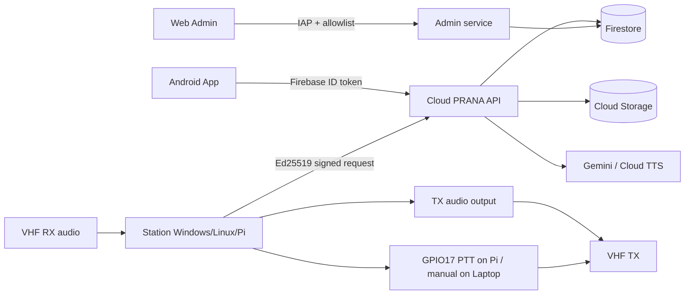
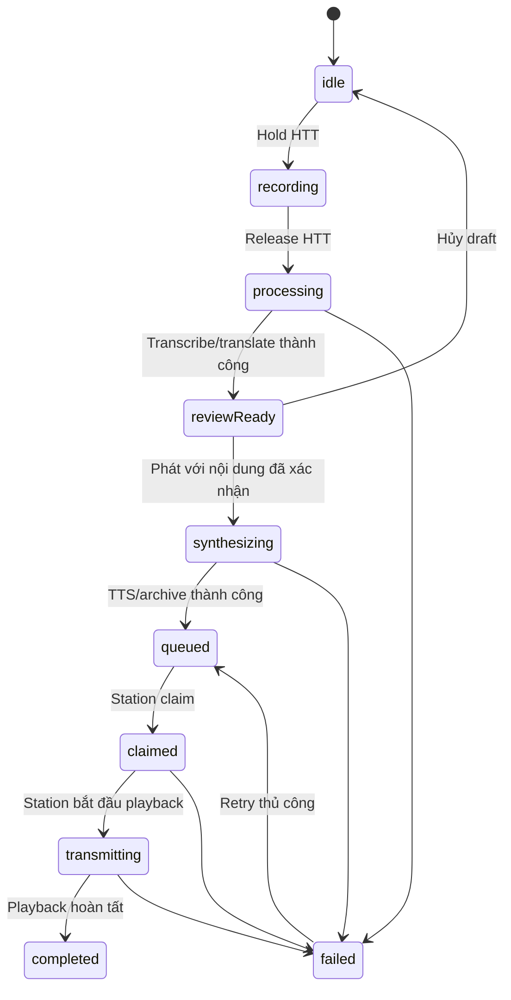

# Kiến trúc Android và Station

> **Phạm vi hiện tại:** Hệ thống hỗ trợ RX hoàn chỉnh và TX Phase 2.1 từ
> Android đến Cloud và audio output của Station. Raspberry Pi Station đã tích
> hợp GPIO17 PTT với watchdog; Laptop Station dùng manual PTT. Hệ thống chưa
> sensing channel busy và đường RF vẫn cần kiểm thử theo phần cứng VHF thực tế.

## Tổng quan

PRANA ELEX gồm bốn vùng chạy độc lập:



- Android là client đăng nhập của người dùng, dùng Firebase Authentication.
- Station không giữ Firebase token; mỗi Station có khóa Ed25519 độc lập.
- PRANA API là đường ghi duy nhất cho Android và Station.
- Android chỉ đọc projection Station của chính chủ sở hữu.
- Web Admin là dịch vụ riêng, được bảo vệ bởi IAP, allowlist và CSRF.
- Android và Station chỉ cần Internet, không cần cùng LAN hoặc inbound port.
- Khách hàng không cần Google Cloud CLI, ADC hoặc quyền IAM.

## Android App

### Điều hướng và trạng thái Station

`GoRouter` chuyển người chưa đăng nhập tới `/sign-in`. Người đã đăng nhập có
route Station list, pairing/activation, Live, History, Station settings và
Account Center. Route `/stations/:id/live` vẫn là màn vận hành chính.

Riverpod quản lý auth, Station projection, health, account, entitlement và Live
results. `LiveController` quản lý desired state RX. `TxController` là nguồn duy
nhất quản lý TX state machine; widget không tự thực hiện timer, network hoặc
business transition.

Android coi Station offline nếu heartbeat quá hạn. Desired state được hiển thị
ở trạng thái chờ cho đến khi `observed_generation` bắt kịp generation mới nhất.
HTT bị khóa nếu Station offline, chưa START hoặc command START/STOP còn pending.

### Màn vận hành RX/TX

TX không nằm ở một tab vận hành riêng. Dock TX nằm dưới Live Translations gồm:

- trạng thái RX/API;
- nút Hold-to-talk ở trung tâm;
- TX language ở phía phải.

Khi giữ HTT, badge RX chuyển thành TX và App thu WAV từ microphone. Khi nhả,
App dừng thu và tạo draft. Review hiển thị transcript gốc chỉ đọc và bản dịch
có thể chỉnh sửa; nội dung cuối không được rỗng và tối đa 2.000 ký tự.

TX language chỉ đổi được khi idle. Nó được snapshot từ lúc bắt đầu recording và
khóa đến terminal state để một request không đổi target giữa chừng.

### TX state machine



Failure bao gồm Station offline/chưa START, audio quá ngắn hoặc không hợp lệ,
microphone permission, processing/TTS/archive, output device và playback. Job
lỗi không tự replay vì có thể gây truyền trùng; người dùng phải retry thủ công.

### Xác thực, tài khoản và pairing

App hỗ trợ Email/Password, Google, xác minh email và quên mật khẩu. Firebase ID
token được gắn vào mọi user request tới PRANA API. Account Center tổng hợp
account, usage, plan, devices và Stations.

Luồng activation cố định dùng Setup ID và activation code trên nhãn QR; QR
không chứa private key. Claim đầu tiên gán owner, scan lại bởi cùng owner là
idempotent. Pairing code tạm thời vẫn được giữ để tương thích.

Gỡ Station dừng desired state, bỏ owner khỏi registry và cho phép tài khoản khác
claim lại tem QR. Lịch sử của owner cũ không chuyển sang owner mới. Transfer
trực tiếp giữa owner chỉ thực hiện trong Web Admin có audit.

## RX pipeline

### Điều khiển và heartbeat

Start/Stop bật hoặc tắt Station runtime. Khi running, RX capture được phép chạy
và TX được phép tạo/confirm/claim. Station poll desired state, gửi heartbeat và
dùng generation counter để áp dụng latest-wins cho Start/Stop, target language
và cấu hình audio.

Heartbeat tách trạng thái hai chiều:

- RX: `capture_state`, session, sequence, input device và processing error.
- TX: `tx_state`, `tx_job_id`, active output device và TX error.

### Xử lý segment

Station thu input audio, VAD tách segment và enqueue `SegmentJob`. Job snapshot
target language ngay lúc enqueue; lần xử lý đầu, network retry và manual retry
đều dùng target của job thay vì đọc config dùng chung.

Station gửi WAV bằng request ký Ed25519. API xác định owner rồi kiểm tra chữ ký,
timestamp, nonce, idempotency, WAV, quota và concurrency. Gemini nhận dạng,
phục hồi transcript và dịch. Kết quả được archive và publish vào Station result
projection.

Language code được normalize theo base code (`VI`, `vi-VN`, `vi_VN` đều là
`vi`). Nếu detected language trùng target, backend dùng transcript đã phục hồi
làm translation thay vì chấp nhận model tự dịch sang ngôn ngữ khác.

### RX playback trên Android

Live App poll result mới và chỉ render log của ngày local hiện tại. Auto-play và
nút loa dùng cùng quy tắc:

- source khác target: TTS trường translation theo target locale;
- source trùng target: tải và phát WAV nguồn;
- WAV nguồn lỗi/không tồn tại: fallback TTS transcript theo detected locale.

Playback dừng khi App background, logout, đổi Station hoặc người dùng tắt auto
audio. Polling/rebuild không tự phát lại log cũ.

## TX pipeline

### 1. Tạo draft

App thu WAV mono từ microphone theo giới hạn entitlement và tạo `request_id`
ngay khi bắt đầu giữ HTT. Multipart retry luôn dựng lại body từ file với cùng
`request_id`. API atomically reserve trạng thái `processing` trước Gemini; cùng
ID/cùng payload trả cùng draft, cùng ID/khác payload trả `IDEMPOTENCY_CONFLICT`.
API chỉ chấp nhận nếu Station thuộc owner, active, running, online và PTT ready.

API validate WAV, chạy Gemini để tạo transcript/bản dịch và archive source WAV.
Giai đoạn này chưa gọi TTS. Draft ở `review_ready` chứa:

- transcript chỉ đọc;
- `translation_original` do AI tạo;
- `translation` hiện tại;
- detected/target language, duration, attempt và logical filename.

### 2. Confirm và tạo output

App gửi nội dung translation cuối sau review. API atomically reserve active TX
slot và chuyển draft sang `synthesizing` với lease 180 giây. Backend lưu cả bản AI gốc và nội dung
cuối, đồng thời đánh dấu `translation_edited` khi hai giá trị khác nhau.

Cloud TTS tổng hợp nội dung cuối thành LINEAR16. Backend chuẩn hóa format, chèn
khoảng lặng khoảng 300 ms và nối clip “Over” tiếng Anh. Output WAV và metadata
được archive trước khi job chuyển sang `queued`. Final WAV gồm cả khoảng lặng và
“Over” không được vượt 120 giây. Lease hết hạn chuyển job sang `failed` với
`TX_SYNTHESIS_TIMEOUT`; kết quả đến muộn không thể hồi sinh job.

Confirm lặp cùng nội dung trả job hiện tại và không tạo WAV/job thứ hai. Confirm
lặp với nội dung khác sau khi draft đã rời review bị từ chối. Nếu TTS hoặc
archive lỗi, job chuyển `failed`, giải phóng active slot và không dùng audio cũ.

### 3. Queue và Station playback

Mỗi Station chỉ có một TX job active. Claim là atomic để nhiều worker không thể
cùng nhận một job. Station chỉ claim khi desired state vẫn running; queued job
sẽ chờ nếu người dùng STOP trước lúc claim.

TX worker thực hiện:

1. claim job và lưu định danh cục bộ;
2. tải source/output WAV;
3. pause capture RX mà không chờ request Gemini RX đang xử lý;
4. kích PTT, chờ key-up 400 ms và báo `transmitting`;
5. phát output WAV qua stable output device ID;
6. giữ tail 300 ms, nhả PTT, lưu receipt và báo terminal state;
7. chỉ resume capture RX nếu desired state mới nhất vẫn running.

Watchdog tuyệt đối 122 giây độc lập audio driver sẽ hạ GPIO và yêu cầu dừng
player khi playback bị treo. PTT cũng được nhả khi shutdown, SIGTERM hoặc exception.

Nếu người dùng STOP trong lúc transmitting, Station phát hết job đã bắt đầu
nhưng không resume RX. Nếu download, device hoặc playback lỗi, Station báo
failed và tuyệt đối không tự phát lại.

## Lưu trữ RX/TX

Dữ liệu mới trên Station dùng cấu trúc:

```text
VHF_Storage/
├── RX/
│   ├── audio/YYYY/MM/DD/
│   └── results/YYYY/MM/DD/
└── TX/
    ├── source/YYYY/MM/DD/
    ├── output/YYYY/MM/DD/
    └── results/YYYY/MM/DD/
```

RX và TX dùng logical stem `YYYYMMDD_HHMMSS_####`; TX sequence độc lập với RX.
Source, output và result của một TX có cùng stem. Retry giữ logical filename và
tăng `attempt`. Dữ liệu legacy ở layout cũ hoặc tên UUID vẫn đọc được và không
bắt buộc migration.

Trên GCS, backend gom RX và TX của cùng một trạm vào chung một `station_folder`
(tên trạm slugify + 8 ký tự đầu station id, ví dụ `VINH_0f90cd8e`):

```text
VHF-Storage/{station_folder}/
├── RX/
│   ├── audio/YYYY/MM/DD/
│   └── result/YYYY/MM/DD/
└── TX/
    ├── source/YYYY/MM/DD/
    ├── output/YYYY/MM/DD/
    └── result/YYYY/MM/DD/
```

Cloud archive không đưa object path ra public API. Audio History được stream
qua endpoint có xác thực và ownership check. Retention hiện hành áp dụng cho
dữ liệu mới; cleanup không xóa job đang active.

Trước khi thống nhất scheme này, TX archive từng ghi vào
`VHF-Storage/{firebase_uid}/{station_id}/TX/...` (tách biệt hoàn toàn khỏi
`station_folder` của RX). Dữ liệu TX cũ theo layout này vẫn đọc được và không
bắt buộc migration, tương tự chính sách áp dụng cho RX legacy data ở trên.
Tương tự, TX output/result từng bị ghi vào `TX/output/1/01/01/` do khoá
timestamp sai; dữ liệu cũ đó cũng được giữ nguyên tại chỗ.

### Múi giờ

Ngày trong đường dẫn lấy theo **múi giờ của chủ sở hữu trạm**, chọn qua Quốc gia
trong Account Center (`PATCH /v1/me`, danh sách từ `GET /v1/countries`). Backend
lưu tên IANA trên user document và đẩy xuống từng trạm qua
`desired_state.timezone`; trạm mới claim được seed ngay lúc claim. Chưa chọn
Quốc gia thì dùng `PRANA_API_DEFAULT_TIMEZONE` (mặc định `UTC`) — đúng bằng hành
vi trước đây.

**Tên file là nguồn sự thật cho ngày.** RX: Station sinh tên file rồi backend
parse ra đường dẫn GCS. TX: backend sinh tên file rồi Station parse ra thư mục
local. Cả hai chiều đều một chiều, nên thư mục trên Pi và prefix trên GCS luôn
khớp nhau kể cả khi Station và backend chạy phiên bản khác nhau — không cần
deploy đồng bộ.

Timestamp ghi vào Firestore vẫn luôn là UTC; chỉ chuỗi `YYYYMMDD_HHMMSS` trong
tên file và `YYYY/MM/DD` trong đường dẫn đi theo múi giờ người dùng. Các endpoint
History nhận thêm query `timezone` (tên IANA) bên cạnh `timezone_offset_minutes`
cũ; ưu tiên tên IANA vì offset cố định gom sai ngày quanh mốc đổi giờ DST.
Heartbeat báo `active_timezone` để phát hiện trạm chưa áp dụng.

## History hợp nhất

Route `/stations/:id/history` và nút History hiện tại được giữ nguyên. Màn hình
có hai tab:

- **RX** mặc định: ngày, search, transcript/translation và playback hiện tại.
- **TX**: chỉ job đã confirm (`synthesizing` trở đi), hiển thị status,
  source/target language, transcript, nội dung cuối, edited flag và attempt.

TX output playback chỉ bật khi output đã tồn tại. Cả hai tab dùng cùng timezone
và `history_past_days`. Tab được giữ khi đi vào chi tiết ngày rồi quay
lại; đóng History và mở lại luôn bắt đầu ở RX.

## Public API và ranh giới tin cậy

User TX API:

```text
POST   /v1/stations/{station_id}/tx/drafts
GET    /v1/stations/{station_id}/tx/drafts/{draft_id}
POST   /v1/stations/{station_id}/tx/drafts/{draft_id}/confirm
DELETE /v1/stations/{station_id}/tx/drafts/{draft_id}
POST   /v1/stations/{station_id}/tx/drafts/{draft_id}/retry
GET    /v1/stations/{station_id}/tx/history/days
GET    /v1/stations/{station_id}/tx/history/days/{date}/jobs
GET    /v1/stations/{station_id}/tx/history/{job_id}/audio
```

Station TX API dùng Ed25519 cho claim, download source/output và update status.
User endpoint dùng Firebase Authentication, active-account check và ownership.
Không endpoint History/list nào trả Cloud object path.

Firestore Rules chỉ cho owner đọc projection và chặn client write. API/Admin SDK
dùng IAM. Private collections giữ station registry, nonce/idempotency, TX job,
active TX state và counter filename.

## Web Admin và vận hành

Web Admin giữ Dashboard, Users, Plans, Stations và Audit. Station detail hiển
thị runtime/generation và các lỗi runtime cần thiết; mutation được bảo vệ bằng
IAP, allowlist, CSRF và transaction/batch cùng audit.

Khách hàng chạy Station Windows bằng `enable_station_api.bat`; mặc định dùng
Cloud API và không yêu cầu `gcloud`/ADC. `-LocalApi` chỉ dành cho developer.
Linux/Pi dùng ALSA/`arecord` cho RX và GPIO17 active-high cho PTT. Nếu GPIO init
lỗi, RX/heartbeat vẫn chạy nhưng `ptt_ready=false` ngăn claim TX. Laptop dùng
manual PTT và không điều khiển GPIO.

## Ranh giới Phase 2.1 và Phase tiếp theo

Đã có trong Phase 2.1:

- microphone HTT trên Android;
- transcript/translation review và chỉnh nội dung;
- Cloud TTS + silence + “Over”;
- atomic queue, manual retry và half-duplex software interlock;
- output playback trên Laptop và Raspberry Pi Station;
- GPIO17 PTT, key-up/tail và software watchdog trên Raspberry Pi;
- lưu trữ và History RX/TX.

Chưa có:

- channel-busy sensing;
- RF transmission và kiểm thử hai bộ VHF;
- watchdog phần cứng độc lập với process/nguồn điện.

Kịch bản kiểm thử tương ứng nằm tại
[android-web-admin-test-scenarios.md](android-web-admin-test-scenarios.md).
Hướng dẫn staging nằm tại [staging-e2e-test-guide.md](staging-e2e-test-guide.md).
