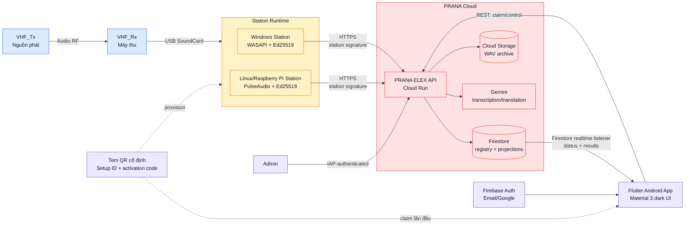

# Sơ đồ tổng quát PRANA ELEX

Sơ đồ dưới đây mô tả luồng dữ liệu và luồng điều khiển trong kiến trúc
Cloud-first. Laptop Windows và Raspberry Pi chạy cùng một Station Runtime;
Android chỉ hiển thị, điều khiển và nhận kết quả realtime.

## Các luồng chính

1. **Audio:** VHF receiver đưa audio qua USB SoundCard vào Station. Station
   chạy VAD, chia đoạn và gửi WAV đã ký tới API.
2. **Xử lý:** API xác thực chữ ký Ed25519, gọi Gemini, lưu WAV vào Cloud
   Storage và ghi kết quả vào Firestore.
3. **Realtime:** Android đọc projection dưới `users/{uid}/stations/**` bằng
   Firestore listener; không đọc trực tiếp registry hoặc credential.
4. **Điều khiển:** Android gửi Start/Stop, ngôn ngữ và Retry bằng REST. Station
   poll desired state mỗi 2 giây và heartbeat mỗi 5 giây.
5. **Ghép trạm:** tem QR chỉ cấp quyền ownership lần đầu. Sau khi claim, các
   điện thoại đăng nhập cùng Firebase account tự thấy station, không cần quét
   lại. Chuyển ownership chỉ do Admin thực hiện.

## Ranh giới tin cậy

- Station không lưu Firebase refresh token và không gọi Gemini/Firestore trực
  tiếp.
- Mobile không ghi Firestore; mọi mutation đi qua API.
- `station_registry` và pairing/activation secrets là server-only; mobile chỉ
  đọc projection đã lọc.
- Audio không đi trực tiếp từ Raspberry Pi tới điện thoại; MVP chỉ truyền text
  transcript/translation.
