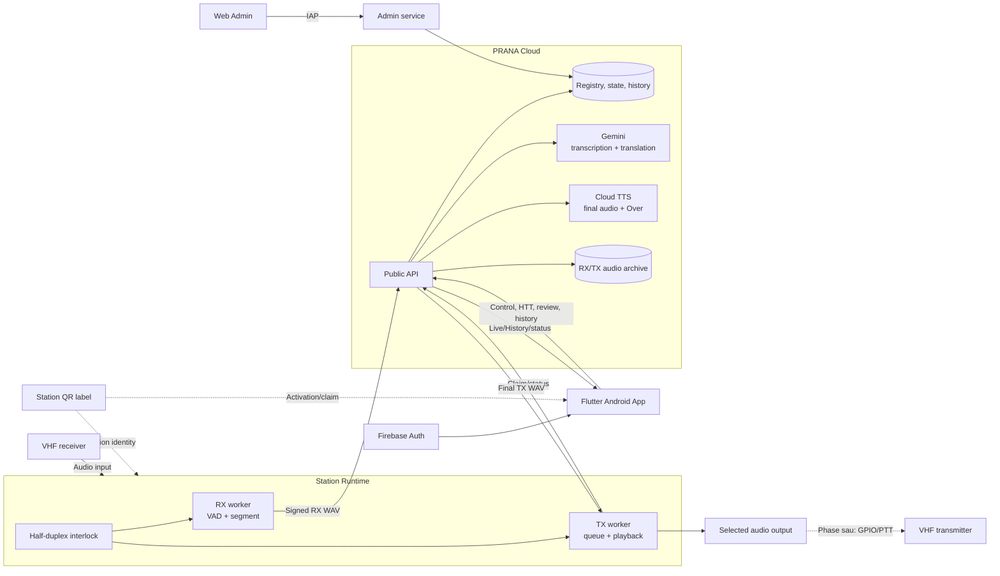

# Sơ đồ tổng quát PRANA ELEX

PRANA ELEX dùng kiến trúc Cloud-first. Windows Laptop và Raspberry Pi chạy cùng
Station Runtime; Android điều khiển RX, thu HTT cho TX, review kết quả và xem
History. TX Phase 2.1 phát WAV tại audio output Station, chưa kích GPIO/PTT hoặc
phát RF qua VHF thật.

```mermaid
flowchart LR
    VHF_RX[VHF receiver] -->|Audio input| ST

    subgraph ST[Station Runtime]
        RX[RX worker\nVAD + segment]
        TX[TX worker\nqueue + playback]
        LOCK[Half-duplex interlock]
        LOCK --> RX
        LOCK --> TX
    end

    RX -->|Signed RX WAV| API
    TX -->|Claim/status| API
    API -->|Final TX WAV| TX
    TX --> OUT[Selected audio output]
    OUT -. Phase sau: GPIO/PTT .-> VHF_TX[VHF transmitter]

    subgraph CLOUD[PRANA Cloud]
        API[Public API]
        FS[(Registry, state, history)]
        GEM[Gemini\ntranscription + translation]
        TTS[Cloud TTS\nfinal audio + Over]
        GCS[(RX/TX audio archive)]
        API --> FS
        API --> GEM
        API --> TTS
        API --> GCS
    end

    AUTH[Firebase Auth] --> APP
    APP[Flutter Android App] -->|Control, HTT, review, history| API
    API -->|Live/History/status| APP

    ADMIN[Web Admin] -->|IAP| ADMINSVC[Admin service]
    ADMINSVC --> FS
    LABEL[Station QR label] -. Activation/claim .-> APP
    LABEL -. Provision identity .-> ST
```

## Các luồng chính

1. **RX:** VHF đưa audio vào Station. RX worker chạy VAD, chia segment, snapshot
   target language và gửi WAV đã ký tới API.
2. **Xử lý RX:** API xác thực Station, gọi Gemini, archive WAV/result và trả Live
   hoặc History cho đúng owner.
3. **TX draft:** Android giữ HTT để thu WAV. API nhận dạng/dịch nhưng chưa TTS;
   người dùng được review và chỉnh translation.
4. **TX confirm:** API tổng hợp nội dung cuối, nối khoảng lặng và “Over”, archive
   output rồi atomically đưa job vào queue.
5. **TX playback:** Station chỉ claim khi running, dừng RX, phát final WAV, báo
   completed/failed rồi chỉ resume RX nếu desired state vẫn running.
6. **Điều khiển:** Android gửi Start/Stop, ngôn ngữ, audio settings và retry qua
   REST. Station poll desired state và gửi heartbeat riêng cho RX/TX.
7. **History:** một màn History có tab RX/TX; API áp dụng cùng timezone,
   entitlement và ownership cho cả hai.

## Ranh giới tin cậy

- Station dùng Ed25519 identity, không lưu Firebase refresh token và không gọi
  trực tiếp Gemini, Firestore hoặc Cloud Storage.
- Android dùng Firebase token; không ghi trực tiếp private collections hoặc
  nhận Cloud object path.
- API xác thực ownership ở mọi endpoint audio/history và quản lý idempotency,
  active TX slot cùng atomic claim.
- Web Admin là deployment riêng, được bảo vệ bởi IAP, allowlist, CSRF và audit.
- Phase 2.1 chỉ điều phối/phát audio bằng phần mềm; GPIO PTT, channel-busy
  sensing, RF và watchdog phần cứng thuộc phase tiếp theo.
