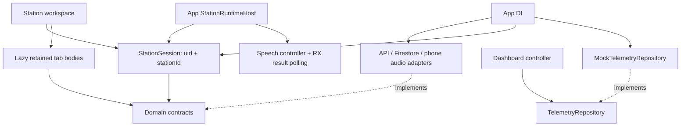

# Android Station Workspace: audit and migration

## Audit before implementation

Inventory was recorded from `git ls-files apps/android` and Android source/config reads before the first Dart migration. Binary assets were inventoried, not treated as source text. The table below preserves that initial inventory; its proposed targets are superseded by the final mapping below.

Before: Flutter/Riverpod/GoRouter/Dio/Firebase Auth/Firestore. `providers.dart` mixed composition, account, projection, health polling and speech. `models/station.dart` mixed Station projection, radio results and SDK conversion. Live owned TX/recorder and restored/synchronized them during build. Speech was app-hosted but selected by Live. History was a route/modal, Settings performed network calls and synchronization waits inside widget State.

Remote RX capture/VAD/segmentation remain in Python Station; transcription stays on Cloud API. Android owns phone audio and the remote control/observation session only.

## Original per-file inventory

| Current | Action | Target | Responsibility / declarations |
|---|---|---|---|
| apps/android/.vscode/launch.json | KEEP / update references | apps/android/.vscode/launch.json | Build/config/test/documentation |
| apps/android/README.md | KEEP / update references | apps/android/README.md | Build/config/test/documentation |
| apps/android/analysis_options.yaml | KEEP / update references | apps/android/analysis_options.yaml | Build/config/test/documentation |
| apps/android/android/app/build.gradle | KEEP / update references | apps/android/android/app/build.gradle | Build/config/test/documentation |
| apps/android/android/app/src/main/AndroidManifest.xml | KEEP / update references | apps/android/android/app/src/main/AndroidManifest.xml | Build/config/test/documentation |
| apps/android/android/app/src/main/kotlin/com/dlv/prana_mobile/MainActivity.kt | KEEP / update references | apps/android/android/app/src/main/kotlin/com/dlv/prana_mobile/MainActivity.kt | MainActivity |
| apps/android/android/app/src/main/res/drawable/ic_launcher_foreground.png | KEEP / update references | apps/android/android/app/src/main/res/drawable/ic_launcher_foreground.png | Asset/binary: keep |
| apps/android/android/app/src/main/res/drawable/launch_background.xml | KEEP / update references | apps/android/android/app/src/main/res/drawable/launch_background.xml | Build/config/test/documentation |
| apps/android/android/app/src/main/res/drawable/splash_logo.png | KEEP / update references | apps/android/android/app/src/main/res/drawable/splash_logo.png | Asset/binary: keep |
| apps/android/android/app/src/main/res/mipmap-anydpi-v26/ic_launcher.xml | KEEP / update references | apps/android/android/app/src/main/res/mipmap-anydpi-v26/ic_launcher.xml | Build/config/test/documentation |
| apps/android/android/app/src/main/res/mipmap-hdpi/ic_launcher.png | KEEP / update references | apps/android/android/app/src/main/res/mipmap-hdpi/ic_launcher.png | Asset/binary: keep |
| apps/android/android/app/src/main/res/mipmap-mdpi/ic_launcher.png | KEEP / update references | apps/android/android/app/src/main/res/mipmap-mdpi/ic_launcher.png | Asset/binary: keep |
| apps/android/android/app/src/main/res/mipmap-xhdpi/ic_launcher.png | KEEP / update references | apps/android/android/app/src/main/res/mipmap-xhdpi/ic_launcher.png | Asset/binary: keep |
| apps/android/android/app/src/main/res/mipmap-xxhdpi/ic_launcher.png | KEEP / update references | apps/android/android/app/src/main/res/mipmap-xxhdpi/ic_launcher.png | Asset/binary: keep |
| apps/android/android/app/src/main/res/mipmap-xxxhdpi/ic_launcher.png | KEEP / update references | apps/android/android/app/src/main/res/mipmap-xxxhdpi/ic_launcher.png | Asset/binary: keep |
| apps/android/android/app/src/main/res/values-v31/styles.xml | KEEP / update references | apps/android/android/app/src/main/res/values-v31/styles.xml | Build/config/test/documentation |
| apps/android/android/app/src/main/res/values/colors.xml | KEEP / update references | apps/android/android/app/src/main/res/values/colors.xml | Build/config/test/documentation |
| apps/android/android/app/src/main/res/values/styles.xml | KEEP / update references | apps/android/android/app/src/main/res/values/styles.xml | Build/config/test/documentation |
| apps/android/android/app/src/staging/AndroidManifest.xml | KEEP / update references | apps/android/android/app/src/staging/AndroidManifest.xml | Build/config/test/documentation |
| apps/android/android/build.gradle | KEEP / update references | apps/android/android/build.gradle | Build/config/test/documentation |
| apps/android/android/gradle.properties | KEEP / update references | apps/android/android/gradle.properties | Build/config/test/documentation |
| apps/android/android/gradle/wrapper/gradle-wrapper.jar | KEEP / update references | apps/android/android/gradle/wrapper/gradle-wrapper.jar | Asset/binary: keep |
| apps/android/android/gradle/wrapper/gradle-wrapper.properties | KEEP / update references | apps/android/android/gradle/wrapper/gradle-wrapper.properties | Build/config/test/documentation |
| apps/android/android/gradlew | KEEP / update references | apps/android/android/gradlew | Build/config/test/documentation |
| apps/android/android/gradlew.bat | KEEP / update references | apps/android/android/gradlew.bat | Build/config/test/documentation |
| apps/android/android/settings.gradle | KEEP / update references | apps/android/android/settings.gradle | Build/config/test/documentation |
| apps/android/assets/logo_lockup.png | KEEP / update references | apps/android/assets/logo_lockup.png | Asset/binary: keep |
| apps/android/assets/logo_mark.png | KEEP / update references | apps/android/assets/logo_mark.png | Asset/binary: keep |
| apps/android/assets/logo_mobileapp.png | KEEP / update references | apps/android/assets/logo_mobileapp.png | Asset/binary: keep |
| apps/android/build.bat | KEEP / update references | apps/android/build.bat | Build/config/test/documentation |
| apps/android/config/production.example.json | KEEP / update references | apps/android/config/production.example.json | Build/config/test/documentation |
| apps/android/config/staging.example.json | KEEP / update references | apps/android/config/staging.example.json | Build/config/test/documentation |
| apps/android/install.bat | KEEP / update references | apps/android/install.bat | Build/config/test/documentation |
| apps/android/lib/app.dart | MOVE + MODIFY | apps/android/lib/app/app.dart | PranaMobileApp |
| apps/android/lib/core/app_config.dart | KEEP / update references | apps/android/lib/core/app_config.dart | AppConfig |
| apps/android/lib/core/languages.dart | KEEP / update references | apps/android/lib/core/languages.dart | Provider/bootstrap/helpers |
| apps/android/lib/core/localization.dart | KEEP / update references | apps/android/lib/core/localization.dart | AppLocaleController, CountryLocalePolicy; translations migrated to lib/l10n ARB + generated AppLocalizations |
| apps/android/lib/core/theme.dart | KEEP / update references | apps/android/lib/core/theme.dart | PranaTheme |
| apps/android/lib/core/user_region.dart | KEEP / update references | apps/android/lib/core/user_region.dart | UserRegionController, CountryOption |
| apps/android/lib/core/widgets.dart | KEEP / update references | apps/android/lib/core/widgets.dart | PranaLogo, PranaPageHeader, StatusPill, EmptyState |
| apps/android/lib/features/account/account_screen.dart | KEEP / update references | apps/android/lib/features/account/account_screen.dart | AccountScreen, _AccountScreenState, StationAccountTile, _Section, _CountryPicker, _CountryPickerState, _TimezonePicker, _PickerSheet, _LanguageToggle, _LanguageOption, _StatusChip |
| apps/android/lib/features/auth/auth_validation.dart | KEEP / update references | apps/android/lib/features/auth/auth_validation.dart | Provider/bootstrap/helpers |
| apps/android/lib/features/auth/sign_in_screen.dart | KEEP / update references | apps/android/lib/features/auth/sign_in_screen.dart | _AuthMode, SignInScreen, _SignInScreenState |
| apps/android/lib/features/auth/verify_email_screen.dart | KEEP / update references | apps/android/lib/features/auth/verify_email_screen.dart | VerifyEmailScreen, _VerifyEmailScreenState |
| apps/android/lib/features/history/history_screen.dart | MOVE + MODIFY | apps/android/lib/features/station/history/history_screen.dart | _HistoryMode, HistoryScreen, _HistoryScreenState, _TxDayHistory, _TxDayHistoryState, _TxHistoryCard, _DayHistory, _DayHistoryState |
| apps/android/lib/features/live/live_controller.dart | MOVE + MODIFY | apps/android/lib/runtime/vhf/live_controller.dart | LiveCommandPhase, LiveUxState, LiveUxController |
| apps/android/lib/features/live/live_screen.dart | MOVE + MODIFY | apps/android/lib/features/station/radio/presentation/live_screen.dart | LiveScreen, _LiveScreenState, LiveHeader, _RxBadge, LanguageStrip, _LanguageLabel, _LanguageValue, LiveFeedHeader, _TranslationFeed, _QuotaBanner, _CommandErrorBanner, _RetryingBanner, _ResultSkeleton |
| apps/android/lib/features/live/translation_result_card.dart | MOVE + MODIFY | apps/android/lib/features/station/radio/presentation/widgets/translation_result_card.dart | TranslationResultCard |
| apps/android/lib/features/pairing/pairing_screen.dart | KEEP / update references | apps/android/lib/features/pairing/pairing_screen.dart | PairingMode, ActivationCodeInputFormatter, PairingScreen, _PairingScreenState |
| apps/android/lib/features/settings/station_settings_screen.dart | MOVE + MODIFY | apps/android/lib/features/station/settings/station_settings_screen.dart | StationSettingsScreen, _StationSettingsScreenState, _SettingsCard, _InformationRow, _Notice, _InlineMessage, _TxRoute, _DeviceDetails, _SaveBar |
| apps/android/lib/features/speech/translation_speech_host.dart | MOVE + MODIFY | apps/android/lib/runtime/station/station_runtime_host.dart | TranslationSpeechHost, _TranslationSpeechHostState |
| apps/android/lib/features/stations/station_list_screen.dart | MOVE + MODIFY | apps/android/lib/features/station/list/station_list_screen.dart | StationListScreen, _StationCard, _StationSkeleton |
| apps/android/lib/features/tx/application/api_tx_repository.dart | MOVE + MODIFY | apps/android/lib/data/radio/api_tx_repository.dart | ApiTxRepository |
| apps/android/lib/features/tx/application/fake_tx_repository.dart | MOVE + MODIFY | apps/android/lib/data/radio/fake_tx_repository.dart | FakeTxRepository |
| apps/android/lib/features/tx/application/tx_controller.dart | MOVE + MODIFY | apps/android/lib/runtime/vhf/tx_controller.dart | TxController |
| apps/android/lib/features/tx/application/tx_recorder.dart | MOVE + MODIFY | apps/android/lib/data/radio/tx_recorder.dart | TxRecorder, PhoneTxRecorder |
| apps/android/lib/features/tx/application/tx_repository.dart | MOVE + MODIFY | apps/android/lib/domain/radio/tx/tx_repository.dart | TxRecordingTooLong, TxRepository, TxPermanentPollingFailure, TxOperationFailure |
| apps/android/lib/features/tx/application/tx_state.dart | MOVE + MODIFY | apps/android/lib/runtime/vhf/tx_state.dart | TxState |
| apps/android/lib/features/tx/domain/tx_draft.dart | MOVE + MODIFY | apps/android/lib/domain/radio/tx/tx_draft.dart | TxRecordingInput, TxDraft |
| apps/android/lib/features/tx/domain/tx_failure.dart | MOVE + MODIFY | apps/android/lib/domain/radio/tx/tx_failure.dart | TxFailure |
| apps/android/lib/features/tx/domain/tx_phase.dart | MOVE + MODIFY | apps/android/lib/domain/radio/tx/tx_phase.dart | TxPhase |
| apps/android/lib/features/tx/presentation/widgets/tx_live_dock.dart | MOVE + MODIFY | apps/android/lib/features/station/radio/presentation/widgets/tx/tx_live_dock.dart | TxLiveDock, TxTalkPad, _RadioStatus, _StatusLine, _CenterControl, _PhaseCircle, _RecordingStatus, _OfflineTxNotice, _DockLanguage |
| apps/android/lib/features/tx/presentation/widgets/tx_ptt_button.dart | MOVE + MODIFY | apps/android/lib/features/station/radio/presentation/widgets/tx/tx_ptt_button.dart | TxPttButton, _TxPttButtonState |
| apps/android/lib/features/tx/presentation/widgets/tx_review_card.dart | MOVE + MODIFY | apps/android/lib/features/station/radio/presentation/widgets/tx/tx_review_card.dart | TxReviewCard, _TxReviewCardState, _ReadOnlySection |
| apps/android/lib/main.dart | KEEP / update references | apps/android/lib/main.dart | Provider/bootstrap/helpers |
| apps/android/lib/models/plan_entitlements.dart | MOVE + MODIFY | apps/android/lib/domain/account/plan_entitlements.dart | PlanEntitlements |
| apps/android/lib/models/station.dart | MOVE + MODIFY | apps/android/lib/domain/station/station.dart | DesiredState, StationAudioDevice, StationCapabilities, StationModel, TranslationResult, StationHistoryDay |
| apps/android/lib/providers.dart | MOVE + MODIFY | apps/android/lib/app/di/providers.dart | Provider/bootstrap/helpers |
| apps/android/lib/router.dart | MOVE + MODIFY | apps/android/lib/app/navigation/router.dart | Provider/bootstrap/helpers |
| apps/android/lib/services/authentication_service.dart | MOVE + MODIFY | apps/android/lib/data/auth/authentication_service.dart | AuthenticationService, FirebaseAuthenticationService |
| apps/android/lib/services/prana_api.dart | MOVE + MODIFY | apps/android/lib/data/network/prana_api.dart | PranaApi, PranaApiFailure |
| apps/android/lib/services/source_audio.dart | MOVE + MODIFY | apps/android/lib/data/radio/source_audio.dart | SourceAudioEngine, SourceFilePlayer, JustAudioSourceFilePlayer, CachedSourceAudioEngine |
| apps/android/lib/services/translation_speech.dart | MOVE + MODIFY | apps/android/lib/runtime/vhf/translation_speech.dart | SpeechEngine, FlutterTtsSpeechEngine, TranslationSpeechController, _SpeechItem |
| apps/android/pubspec.lock | KEEP / update references | apps/android/pubspec.lock | Build/config/test/documentation |
| apps/android/pubspec.yaml | KEEP / update references | apps/android/pubspec.yaml | Build/config/test/documentation |
| apps/android/run.bat | KEEP / update references | apps/android/run.bat | Build/config/test/documentation |
| apps/android/scripts/build-apk.ps1 | KEEP / update references | apps/android/scripts/build-apk.ps1 | Build/config/test/documentation |
| apps/android/scripts/install-apk.ps1 | KEEP / update references | apps/android/scripts/install-apk.ps1 | Build/config/test/documentation |
| apps/android/scripts/run.ps1 | KEEP / update references | apps/android/scripts/run.ps1 | Build/config/test/documentation |
| apps/android/test/account_station_code_test.dart | KEEP / update references | apps/android/test/account_station_code_test.dart | Build/config/test/documentation |
| apps/android/test/activation_code_formatter_test.dart | KEEP / update references | apps/android/test/activation_code_formatter_test.dart | Build/config/test/documentation |
| apps/android/test/authentication_test.dart | KEEP / update references | apps/android/test/authentication_test.dart | Build/config/test/documentation |
| apps/android/test/history_day_test.dart | KEEP / update references | apps/android/test/history_day_test.dart | Build/config/test/documentation |
| apps/android/test/live_controller_test.dart | KEEP / update references | apps/android/test/live_controller_test.dart | Build/config/test/documentation |
| apps/android/test/live_layout_test.dart | KEEP / update references | apps/android/test/live_layout_test.dart | _NoopSpeechEngine, _NoopSourceAudioEngine |
| apps/android/test/live_talk_layout_test.dart | KEEP / update references | apps/android/test/live_talk_layout_test.dart | Build/config/test/documentation |
| apps/android/test/pairing_link_test.dart | KEEP / update references | apps/android/test/pairing_link_test.dart | Build/config/test/documentation |
| apps/android/test/plan_entitlements_test.dart | KEEP / update references | apps/android/test/plan_entitlements_test.dart | Build/config/test/documentation |
| apps/android/test/prana_api_failure_test.dart | KEEP / update references | apps/android/test/prana_api_failure_test.dart | Build/config/test/documentation |
| apps/android/test/resilient_poll_test.dart | KEEP / update references | apps/android/test/resilient_poll_test.dart | Build/config/test/documentation |
| apps/android/test/source_audio_test.dart | KEEP / update references | apps/android/test/source_audio_test.dart | FakeFilePlayer |
| apps/android/test/station_model_test.dart | KEEP / update references | apps/android/test/station_model_test.dart | Build/config/test/documentation |
| apps/android/test/station_settings_layout_test.dart | KEEP / update references | apps/android/test/station_settings_layout_test.dart | Build/config/test/documentation |
| apps/android/test/translation_speech_test.dart | KEEP / update references | apps/android/test/translation_speech_test.dart | FakeSpeechEngine, FakeSourceAudioEngine |
| apps/android/test/tx_controller_test.dart | KEEP / update references | apps/android/test/tx_controller_test.dart | _OfflineTxRepository, _LostConfirmRepository, _RestoreRacesConfirmRepository |
| apps/android/test/tx_live_dock_test.dart | KEEP / update references | apps/android/test/tx_live_dock_test.dart | Build/config/test/documentation |
| apps/android/test/tx_review_card_test.dart | KEEP / update references | apps/android/test/tx_review_card_test.dart | Build/config/test/documentation |
| apps/android/test/user_region_test.dart | KEEP / update references | apps/android/test/user_region_test.dart | Build/config/test/documentation |

## Implemented architecture

```text
Before lib/                       After lib/
app.dart, router.dart             app/app.dart, app/navigation/router.dart
providers.dart                    app/di/ (six focused wiring files)
models/                           domain/{station,radio/tx,account}/
services/                         data/{auth,network,station,radio}/
features/live,tx,speech            runtime/{station,vhf}/ + station/radio/presentation/
features/stations                 features/station/list/
features/history,settings         features/station/{history,settings}/
                                  features/station/{workspace,dashboard,shared}/
                                  telemetry/{domain,data}/
core/, auth/account/pairing        same responsibilities; updated references
```

| Boundary | Responsibility and dependencies |
|---|---|
| app/di | Selects repository/engine implementations. Wires auth/account, projection, session, history, telemetry. |
| domain | SDK-free Station, result/history, entitlement and TX models/contracts. |
| data/station | Firestore Timestamp normalization and projection mapping. StationRepository adapts existing PranaApi desired-state method. |
| data/network | Existing REST endpoints, Dio auth interceptor and retry behavior. No public schema changes. |
| data/radio | API TX/history repositories; phone recorder, TTS and source audio adapters. TX repository instances are session-owned; active-job keys are scoped by uid. |
| runtime/station | App-level StationRuntimeHost selects/retains session by uid and Station id, drives foreground/audio and auth/release cleanup. StationSession owns RX/TX controllers and synchronized projection. |
| runtime/vhf | RX commands/optimistic command state, TX state machine and speech deduplication/queue. No feature imports. |
| workspace | Routes/Back/discard policy, lazy IndexedStack, retained tab UI state. Watches a derived StationRuntimeState including projection, connection and telemetry. |
| dashboard | Controller subscribes only through TelemetryRepository, computes freshness and UI-only mock mode. Parameterized instrument widgets and offline CustomPainter map. |
| history/settings | History loading via typed repository/controller; Settings controller owns desired-state saves and synchronization waits. Filters, scroll and unsaved form selections remain widget state. |
| core | Existing theme/localization/shared widgets, plus cancellable lifecycle wait. |



### Lifecycle and navigation

- Station list opens `/stations/:id/control`. Existing `/live`, `/history`, `/settings` suffixes render in the same workspace, and an unknown suffix - including a saved `/dashboard` link from before the readings moved into Control - lands on Control. Tab replacement keeps the page identity; route identity also includes uid. Auth refresh updates redirect policy without rebuilding the router.
- Workspace attachment selects phone observation/audio only. No tab or Back path sends START/STOP. START/STOP remains in Live VHF.
- Host keeps the selected session and RX polling alive after Back while app is foreground. Telemetry belongs to workspace observation and can dispose independently.
- Recording leaves its phase synchronously before awaiting stop, so tab and pointer release cannot upload twice. Background cancellation invalidates the operation before awaiting microphone startup. Processing/queued/transmitting belong to the session.
- Review is auto-opened only on active Live, once per draft, marked only when opening actually occurs. Text edits survive closing/reopening and tab changes. Confirm is phase-guarded; failed TX still requires manual retry.
- Back from History detail returns to days. Leaving unconfirmed recording/draft asks for discard. Confirmed server TX is not cancelled or replayed by local teardown; restore uses the existing job endpoints/projection.
- Auth identity change, release or leaving the selected session cancels local subscriptions/timers/recording. Async completions check lifecycle epochs/disposal. No STOP is sent to the former Station.
- History TX playback stops on tab exit/background; late download/player initialization cannot resume it. Temporary WAVs are cleaned. Auto Audio choice remains independent.
- Telemetry emits one immediate sample then one per second, with injectable clock/ticks and deterministic elapsed-time generator. Missing/stale (>5 seconds)/error/retry are separate states; mock controls never call desired-state. Map is offline and labeled simulation, never navigation.

## Final CREATE / MOVE / MODIFY / DELETE / KEEP

MOVE includes updated imports and, where required, responsibility extraction. Original files listed here are deleted after migration; no re-export bridges remain.

| Original path relative to lib/ | Final target | Action |
|---|---|---|
| `app.dart` | `app/app.dart` | MOVE + MODIFY |
| `router.dart` | `app/navigation/router.dart` | MOVE + MODIFY |
| `providers.dart` | `app/di/{auth,account,station,radio,history,telemetry}_providers.dart` | SPLIT + MODIFY |
| `models/station.dart` | `domain/station/station.dart` | SPLIT + MODIFY |
| `models/plan_entitlements.dart` | `domain/account/plan_entitlements.dart` | MOVE + MODIFY |
| `services/prana_api.dart` | `data/network/prana_api.dart` | MOVE + MODIFY |
| `services/authentication_service.dart` | `data/auth/authentication_service.dart` | MOVE + MODIFY |
| `services/source_audio.dart` | `data/radio/source_audio.dart` | MOVE + MODIFY |
| `services/translation_speech.dart` | `runtime/vhf/translation_speech.dart` | SPLIT + MODIFY |
| `features/speech/translation_speech_host.dart` | `runtime/station/station_runtime_host.dart` | MOVE + MODIFY |
| `features/live/live_controller.dart` | `runtime/vhf/live_controller.dart` | MOVE + MODIFY |
| `features/live/live_screen.dart` | `features/station/radio/presentation/live_screen.dart` | MOVE + MODIFY |
| `features/live/translation_result_card.dart` | `features/station/shared/widgets/translation_result_card.dart` | MOVE + MODIFY |
| `features/history/history_screen.dart` | `features/station/history/history_screen.dart` | MOVE + MODIFY |
| `features/settings/station_settings_screen.dart` | `features/station/settings/station_settings_screen.dart` | MOVE + MODIFY |
| `features/stations/station_list_screen.dart` | `features/station/list/station_list_screen.dart` | MOVE + MODIFY |
| `features/tx/application/api_tx_repository.dart` | `data/radio/api_tx_repository.dart` | MOVE + MODIFY |
| `features/tx/application/fake_tx_repository.dart` | `../test/support/fake_tx_repository.dart` | MOVE + MODIFY |
| `features/tx/application/tx_controller.dart` | `runtime/vhf/tx_controller.dart` | MOVE + MODIFY |
| `features/tx/application/tx_recorder.dart` | `data/radio/tx_recorder.dart` | SPLIT + MODIFY |
| `features/tx/application/tx_repository.dart` | `domain/radio/tx/tx_repository.dart` | MOVE + MODIFY |
| `features/tx/application/tx_state.dart` | `runtime/vhf/tx_state.dart` | MOVE + MODIFY |
| `features/tx/domain/tx_draft.dart` | `domain/radio/tx/tx_draft.dart` | MOVE + MODIFY |
| `features/tx/domain/tx_failure.dart` | `domain/radio/tx/tx_failure.dart` | MOVE + MODIFY |
| `features/tx/domain/tx_phase.dart` | `domain/radio/tx/tx_phase.dart` | MOVE + MODIFY |
| `features/tx/presentation/widgets/tx_live_dock.dart` | `features/station/radio/presentation/widgets/tx/tx_live_dock.dart` | MOVE + MODIFY |
| `features/tx/presentation/widgets/tx_ptt_button.dart` | `features/station/radio/presentation/widgets/tx/tx_ptt_button.dart` | MOVE + MODIFY |
| `features/tx/presentation/widgets/tx_review_card.dart` | `features/station/radio/presentation/widgets/tx/tx_review_card.dart` | MOVE + MODIFY |

New files not covered by the one-to-one move table:

- CREATE `app/di/account_providers.dart`
- CREATE `app/di/auth_providers.dart`
- CREATE `app/di/history_providers.dart`
- CREATE `app/di/radio_providers.dart`
- CREATE `app/di/station_providers.dart`
- CREATE `app/di/telemetry_providers.dart`
- CREATE `runtime/station/station_session.dart`
- CREATE `core/cancellable_delay.dart`
- CREATE `data/radio/api_history_repository.dart`
- CREATE `data/radio/flutter_speech_engine.dart`
- CREATE `data/station/firestore_station_repository.dart`
- CREATE `domain/radio/history_repository.dart`
- CREATE `domain/radio/results.dart`
- CREATE `domain/radio/source_audio_engine.dart`
- CREATE `domain/radio/speech_engine.dart`
- CREATE `domain/radio/tx/tx_recorder.dart`
- CREATE `domain/station/station_repository.dart`
- CREATE `features/station/dashboard/application/dashboard_controller.dart`
- CREATE `features/station/dashboard/presentation/dashboard_tab.dart`
- CREATE `features/station/dashboard/presentation/widgets/control_widget.dart`
- CREATE `features/station/dashboard/presentation/widgets/depth_widget.dart`
- CREATE `features/station/dashboard/presentation/widgets/heading_widget.dart`
- CREATE `features/station/dashboard/presentation/widgets/instrument_value.dart`
- CREATE `features/station/dashboard/presentation/widgets/map_widget.dart`
- CREATE `features/station/dashboard/presentation/widgets/position_widget.dart`
- CREATE `features/station/dashboard/presentation/widgets/speed_widget.dart`
- CREATE `features/station/dashboard/presentation/widgets/status_widget.dart`
- CREATE `features/station/history/history_controller.dart`
- CREATE `features/station/radio/presentation/widgets/language_strip.dart`
- CREATE `features/station/radio/presentation/widgets/live_feed.dart`
- CREATE `features/station/radio/presentation/widgets/live_header.dart`
- CREATE `features/station/settings/station_settings_controller.dart`
- CREATE `features/station/workspace/station_tab.dart`
- CREATE `features/station/workspace/station_workspace_screen.dart`
- CREATE `telemetry/data/mock_telemetry_generator.dart`
- CREATE `telemetry/data/mock_telemetry_repository.dart`
- CREATE `telemetry/domain/telemetry_repository.dart`

MODIFY: bootstrap `main.dart`, localization, shared EmptyState scrolling, auth/account/pairing imports, Flutter test imports and Android packaging path assertions. CREATE regression suites `dashboard_test`, `station_session_test`, `station_workspace_test` and test support. KEEP: logo/assets/theme identity, Gradle/dependencies, Android native code, Python core, Windows/Linux, public API/Admin, Firebase rules, Terraform.

## Verification record

Baseline before migration: **108 Flutter tests passed**.

| Check | Result |
|---|---|
| `dart format --output=none --set-exit-if-changed lib test` | PASS: 100 files, 0 changed |
| `flutter analyze --no-pub` | PASS: no issues |
| `flutter test --no-pub` | PASS: 144 tests |
| `python -m pytest tests/packaging/test_mobile_android_config.py tests/conventions -q --basetemp=build/buildapp/workspace-pytest-resume` | PASS: 59 tests, 78 subtests; one pytest cache warning |
| `git diff --check` | PASS |

The resumed Python run needed a new explicit basetemp because the earlier sandbox-owned temp directory was inaccessible after switching execution context. No test logic was bypassed.

### PASS by mock/contract test

- Dashboard opens idle/running Stations without START/STOP; generation/session values remain unchanged. Runtime and telemetry subscription count stay stable across all four tabs.
- RX arriving on Dashboard is ingested once; revisiting Live does not replay it. Auto Audio continues after Back to the Station list.
- HTT tab departure calls recorder stop once, processes a draft and never confirms it automatically. Review opens only on Live, once per draft; edited text survives dismissal and tab changes.
- Processing/queued/transmitting/completed are observed across tab navigation. Duplicate confirm is rejected; existing manual retry/error-path regressions remain green.
- Delayed microphone startup, background cancellation, RX command completion after dispose, source-audio download and TTS locale resolution cannot update/play into a later session.
- Station switch creates a separate identity-scoped session; release, user switch and logout clear selected local state without STOP requests.
- Telemetry immediate sample/injected ticks, movement, missing/stale/error/retry and disposal are checked. Mock controls do not invoke Station API.
- Dashboard and all four workspace tabs: 360x800, 800x360, 1024x768, 1280x800; vi/en; text scale 1.0/1.5/2.0, no overflow. Header/tabs remain reachable; short Live content and History empty state scroll.
- Dependency tests prohibit runtime -> features, dashboard -> mock data/Live UI, and domain -> Firestore SDK. No old provider barrel or Live source bridge.

These are phone-side/mock/contract checks, not RF or hardware validation. APK and emulator results follow below.

### APK and emulator validation

- PASS: staging debug APK built with the existing `apps/android/scripts/build-apk.ps1 -Flavor staging -BuildMode debug`; no release/deployment.
- Final artifact: `installers/android/staging/prana-elex-staging-debug.apk`, 233529492 bytes (~222.71 MiB).
- SHA-256: `1ef06c51765f71970cda501eff44b1d3f5b03d943620581f84702cccd89888b6`.
- The first build was interrupted by the user. A completed build then exposed damaged Unicode in new Dashboard labels during emulator inspection; labels/placeholders were corrected, exact vi/en text assertions added, and the final APK regenerated. Only the corrected final artifact is delivered.
- PASS: installed with `adb install -r` on Prana_API_36 (Android emulator). Dashboard portrait 1080x2400 and landscape 2400x1080 at density 420 were inspected. Speed/depth/heading update; landscape uses three columns; scroll preserves header/tabs and exposes separate real Station Offline versus simulated telemetry status. Live, History and Settings were also opened in the same workspace.
- Final screenshots/logs/manifest: `build/buildapp/workspace-evidence/`. Screenshots: `dashboard-portrait.png`, `dashboard-landscape.png`, `dashboard-landscape-scrolled.png`, `live-landscape.png`, `history-landscape.png`, `settings-landscape.png`.
- Emulator orientation settings restored to their original values (accelerometer_rotation=1, user_rotation=0). No Station START/STOP or transmit control was used during the UI inspection. App error-level Flutter/AndroidRuntime log capture during final inspection was empty.

### Real Station verification and remaining debt

- **CHUA KIEM CHUNG / NOT VERIFIED:** online Station session/generation/sequence before/during/after tab switching; new real RX audio, physical-phone microphone/audio, server TX playback, GPIO/PTT timing and RF. The available staging Station projection was OFFLINE. Mock/contract results above do not establish hardware behavior.
- Telemetry, coordinate map and Auto/Manual control remain intentionally simulated. There is no sensor/GPS/map SDK/backend telemetry integration.
- Existing flutter_tts/mobile_scanner plugins emit a Gradle warning about future built-in Kotlin compatibility. The final build succeeds; dependency upgrades remain a separate task.
- Local lifecycle cancellation prevents late results/audio and cancels local waits. Requests already accepted by the server may finish there; confirmed TX is deliberately not stopped by local teardown. Active-job storage is uid-scoped; legacy unscoped keys are not read, with remote active-job restore driven by the existing Station projection.
- History/settings retain presentation state in their widgets; their data-loading and command/synchronization boundaries are extracted. Further subdivision of the large presentation files is optional follow-up work.

No Python core, Windows/Linux, API/Admin, Firebase rule or Terraform behavior was changed. No commit, push, production release or deployment was performed.

## Follow-up: two primary tabs (2026-09-08)

- The tab bar now exposes only Dashboard and Live VHF. `StationTab` describes these two choices; `StationPage` also includes History and Settings as secondary route destinations.
- The workspace header owns the Settings gear. Live VHF retains its History icon and START/STOP controls. Secondary pages hide the tab bar and use the workspace Back action; Settings returns to its opener, History returns to Live, and History detail first returns to its day list. Direct Settings/History links default back to Dashboard/Live respectively.
- The same keyed workspace and lazy retained bodies own presentation state across route replacements. History filters and unsaved Settings selections survive navigation. The app-level Station session, TX, Auto Audio and subscriptions retain their existing ownership; opening a secondary page ends an active recording without confirming the draft.
- Dashboard speed, depth, heading and position labels use existing Material icons. Icon labels wrap, values retain units/tabular figures, and decorative icons are excluded from repeated accessibility announcements.
- Verification: 146 Flutter tests passed, including idle/running navigation, direct secondary links, retained filter/settings/draft state, RX/Auto Audio and TX continuity, and the vi/en viewport/text-scale matrix. Flutter analyze found no issues. No new APK was built for this follow-up; emulator UI updates use Flutter attach/hot restart.
- Emulator verification: inspected Dashboard portrait/landscape, Settings opened from the header and returned to Dashboard, History opened from Live and Back returned through its day list to Live. Screenshots: `build/buildapp/two-tabs-{portrait,landscape,settings,history}.png`. Restored orientation settings to accelerometer_rotation=1/user_rotation=0. The available VINH Station projection was Online/Idle; no START/STOP, save, recording or transmission controls were exercised. RF and real RX/TX continuity remain unverified by this UI follow-up.
